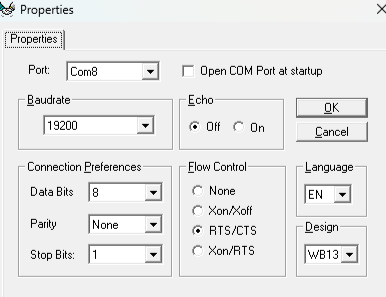

# Transfer any game from your PC to your Amiga 500
This document describes ONE way to transfer games from your PC to your Amiga 500 and play on the good old machine. There are other methods but I find this one to be the easiest.

## Requirements

### Hardware
0. A working Amiga 500 :-)
1. Some formatted, 3.5", 880KB floppy disks for the Amiga to write to
2. A null-modem cable (crossover serial cable). If you use a USB→serial adapter, make sure it supports true RS‑232 levels and hardware RTS/CTS flow control
3. A working PC :-)

### Software
0. [Amiga] A working, virus-free Transwarp disk
1. [Amiga] A working, virus-free Workbench 1.3 disk
2. [Amiga] An XCopy disk or any virus checker so you can virus-check your Workbench 1.3 disk
3. [PC] ADF Sender Terminal
4. [PC] Some ADF files that you are legally allowed to use

## Steps

### Hardware setup
0. Connect a null-modem (crossover) serial cable between the Amiga's serial port and the PC (or to a USB→serial adapter connected to the PC)
    1. If you only have a straight-through cable, it will not work unless one end or adapter performs null-modem crossover
    2. If using a USB→serial adapter, verify the adapter supports RS‑232 voltage levels and hardware RTS/CTS. Cheap TTL-level adapters will not work reliably
1. Turn on your Amiga
2. Turn on your PC
3. And that's all the hardware prep you need

### Software setup - Amiga
0. **The most important step**: Virus-check your Workbench 1.3 and Transwarp disks. You can do this via a variety of tools, including the Diskcheck function of XCopy. If your Workbench 1.3 disk has a virus in its boot sector, then so will every disk you write via this process. Your life will be a living hell. **Please don't skip this step.**
1. Boot Amiga from a clean Workbench 1.3 disk.
2. Open Prefs
3. Open Serial
4. Set these settings:
    1. Baud rate: 19200
    2. Buffer size: 4096
    3. Read bits: 8
    4. Write bits: 8
    5. Stop bits: 1
    6. Parity: None
    7. Handshaking: RTS/CTS
5. Select OK
6. Select Use or Save. Save writes the settings to the diskette permanently, so the floppy diskette has to be write-enabled. **Make sure you have another working copy of your Workbench disk before saving onto it.**
7. Open Shell and move the Shell screen down a bit (you will see why in a second).
8. Insert Transwarp disk
9. Copy Transwarp program to RAM by running the following commands
    1. cd df0:c
    2. copy transwarp RAM:
    3. cd RAM:
10. Insert Workbench disk again
11. Start transwarp
    1. Write the following command in your shell:
        1. transwarp -b 19200 -w ser: -1
    2. If all went well, you should now see a prompt to insert the empty disk and hit return
12. Insert the empty disk and hit return :-) **Make sure your disk is write-enabled (black little flap on the top right corner covering the hole)**
    1. On the top right corner of your desktop, you should see an empty disk (a picture of a disk with the word EMPTY written under it, or whatever you called it while formatting it).
    2. If it says DF0:BAD, then it's a bad disk; try another disk. Yes, this is why I had you move the Shell window down on step 7, so you can see this. This is also why I use Workbench instead of booting Transwarp directly.
13. Your Amiga is now listening to the serial port, ready to capture anything that comes in and write it to the empty disk. Time to move to the PC side.

### Software setup - PC
0. Install ADF Sender Terminal v1.5 r4 (Note: These instructions work with this particular version. I recommend you use the latest version and try to modify the rest of the steps if needed to fit the newer version)
1. Open Device Manager and find which port your cable that goes to your Amiga is connected to (in my example below it is Com8)
2. Go to Comm Port -> Properties
    1. Set your Port setting to what you found in the earlier step (in this example it is Com8)
    2. Set these settings:
    
3. Click the red circle to make it green (open connection)
4. Go to File -> Transmit file (binary) and select file to send (You should now see progress on both the PC and the Amiga sides)
